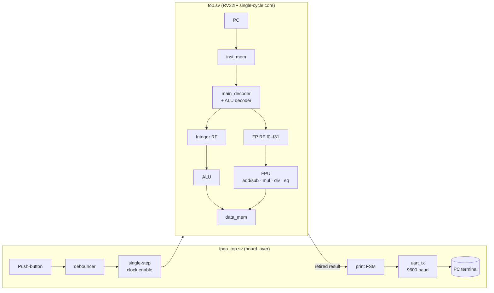

# Single-Cycle RISC-V Processor with an IEEE-754 FPU (RV32I + RV32F subset) on FPGA

The Digital Systems Design capstone project of the Digital IC Design & Verification training at GIKI (USTP). It is a single-cycle RV32I core in SystemVerilog with a custom single-precision floating-point unit. It runs on a **Digilent Nexys A7 (Artix-7)** board, and you step it one instruction at a time with a push-button. Each result is printed to a PC terminal over **UART**.

**Team:** Abdul Samad Abbasi · Govind · Shahzaib Hassan

## Highlights
- **Instructions:**
  - integer: `add sub and or xor sll srl addi lw sw beq jal`
  - floating point: `flw fsw fadd.s fsub.s fmul.s fdiv.s feq.s`
- **Floating-point unit:** a second 32 × 32 register file (`f0`–`f31`) sits in parallel with the integer datapath, rather than being attached over a bus.
  - `fp_add_sub.sv`: unpacks the operands, aligns them with guard/round/sticky bits, adds or subtracts, normalises with leading-one detection, and rounds to nearest-even.
  - `fpu_mul.sv`: forms a 48-bit mantissa product, normalises it and rounds to nearest-even. It saturates to ±∞ on overflow and flushes to zero on underflow.
  - `fpu_div.sv`: scales the dividend by 2^26 so the quotient keeps guard and round bits. The remainder acts as the sticky bit, so it also rounds to nearest-even.
  - `feq.s` writes its result into the **integer** register file.
- **Board layer (`fpga_top.sv`):**
  - a debounced push-button that steps the core one clock per press
  - a UART transmitter at 9600 baud
  - an FSM that prints each retired instruction's result as 8 hex characters
- **Memories:** the instruction memory is loaded from `sw/inst_mem.mem`. The data memory is Xilinx distributed-memory IP, initialised from `sw/data_mem_init.coe`.

## Architecture


## Repository layout
```
rtl/          core (top.sv), FPU (fp_add_sub, fpu_mul, fpu_div, FregFile), board layer
              (fpga_top, debouncer, uart_tx, baud_rate_generator) and datapath blocks
tb/           tb_top_self_check.sv (full-program self-check), fpu_add_sub_testbench.sv
sw/           program.s test program, inst_mem.mem / .hex, data_mem_init.coe
constraints/  nexys_a7.xdc
```

## Verification
`tb/tb_top_self_check.sv` runs the whole test program (`sw/program.s`). After **every** retired instruction it compares the result, PC and next PC with a golden value, giving **27 checks** in total. The checks cover:
- integer ALU operations
- taken and not-taken branches, and `jal`
- integer and floating-point loads and stores
- `fadd.s`, `fsub.s`, `fmul.s` and `fdiv.s`
- both outcomes of `feq.s`

The same run also captures the UART byte stream. The report shows all 27 checks passing, and the hex values sent over UART match the core's results bit for bit. There is also a standalone testbench for the floating-point adder/subtractor.

## FPGA results (Nexys A7, 100 MHz clock)
| Metric | Value |
|---|---|
| Worst negative slack (setup) | **+5.659 ns** (all constraints met) |
| Worst hold slack | +0.148 ns |
| Total on-chip power | **0.234 W** (0.137 W dynamic, 0.097 W static) |

## Build
1. Create a Vivado project for the Nexys A7 board.
2. Add `rtl/*.sv` and `constraints/nexys_a7.xdc`. Then generate a Distributed Memory Generator IP named `dist_mem_gen_0` (single-port RAM, 256 × 32-bit) initialised with `sw/data_mem_init.coe`.
3. Put `sw/inst_mem.mem` where `inst_mem.sv`'s `$readmemh` can find it.
4. Simulate with `tb_top_self_check` as the top, or set `fpga_top` as the synthesis top and generate a bitstream.
5. On the board, open a 9600-baud terminal. Each press of BTNC runs one instruction and prints its result.

## Possible improvements
- Pipeline the core instead of stepping it one instruction at a time.
- Move the UART (and the FPU pattern) onto a memory-mapped peripheral bus.
- Extend the self-check with randomised instruction sequences.
